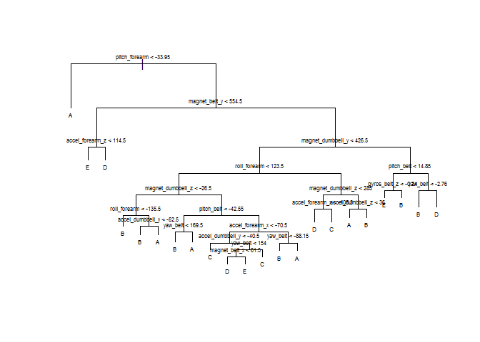

# pml_assignment
Madan Lamichhane  
October 21, 2015  
## Loading and cleaning data
First of all we can load both the training and testing data as follows;


```r
# Loading data
testData = read.csv("pml-testing.csv", na.strings=c("NA", ""))
trainData = read.csv("pml-training.csv", na.strings=c("NA", ""))

# Original dimension of data
dim(testData)
```

```
## [1]  20 160
```

```r
dim(trainData)
```

```
## [1] 19622   160
```
Initially test data has 160 variables with 19622 observations. But when we check variables, we can observe a lot of variables contain NA or balank space. Therefore the variables containing only NA or blank space have been removed.


```r
naCols_train = apply(trainData, 2, FUN=function(x){sum(is.na(x))})
selTrainData = trainData[, c(names(naCols_train)[naCols_train == 0])]
dim(selTrainData)
```

```
## [1] 19622    60
```
After removing columns containing all NA data, the number of variables has been reduced to 60. Since some of the variables like "X", "user_name", "raw_timestamp_part_1", "raw_timeStamp_part_2", "cvtd_temestamp", "new_window", and "num_window" do not play any role in the outcome, they have been removed from training set.


```r
dummyVar = c("X", "user_name", "raw_timestamp_part_1", "raw_timestamp_part_2", "cvtd_timestamp", "new_window","num_window")
finalTrainData = selTrainData[, !(colnames(selTrainData) %in% dummyVar)]
dim(finalTrainData)
```

```
## [1] 19622    53
```
Among the remaining variables, if any two or more variables are highly correlated we can choose only one among them.


```r
library(corrplot)
```

```
## Warning: package 'corrplot' was built under R version 3.2.2
```

```r
corMatrix = cor(finalTrainData[, -53])
corrplot(corMatrix, method="square", tl.cex=0.5)
```

 

We can see that most of the variables are not highly correlated in the plot. Lets set the cutoff value of correlation 0.9 to remove the varible which are highly correlated. In that way we can remove few variables.


```r
library(caret)
```

```
## Warning: package 'caret' was built under R version 3.2.2
```

```
## Loading required package: lattice
## Loading required package: ggplot2
```

```
## Warning: package 'ggplot2' was built under R version 3.2.2
```

```r
cutCor = findCorrelation(corMatrix, cutoff=0.9)
reducedTrain = finalTrainData[, -c(cutCor)]
dim(reducedTrain)
```

```
## [1] 19622    46
```

This reduces the number of variables to 46. Now we can pratition the training set into sample training (70%) and testing (30%) sets.


```r
inTrain = createDataPartition(reducedTrain$classe, p=0.7, list=FALSE)
sampleTrain = reducedTrain[inTrain,]
sampleTest = reducedTrain[-inTrain,]
```

## Anaysis
We can use different method to train and predict test data until we get high accuracy in prediction. Initially I started with tree package.

### Analysis using Tree package


```r
library(tree)
```

```
## Warning: package 'tree' was built under R version 3.2.2
```

```r
treeFit = tree(classe ~ ., data=sampleTrain)
plot(treeFit)
text(treeFit, cex = 0.5)
```

 


```r
treePred = predict(treeFit, sampleTest, type="class")
treeMatrix = table(sampleTest$classe, treePred)
accuracyTree = sum(diag(treeMatrix))/sum(as.vector(treeMatrix))
accuracyTree
```

```
## [1] 0.6713679
```

The accuracy from regression tree is not quite high for predicting sample train data. Hence I moved forward to random forrest method.

### Analysis with random forrest method

```r
library(randomForest)
```

```
## Warning: package 'randomForest' was built under R version 3.2.2
```

```
## randomForest 4.6-12
## Type rfNews() to see new features/changes/bug fixes.
```

```r
rfFit = randomForest(classe ~ ., data=sampleTrain, ntree=60, importance=TRUE)
rfFit
```

```
## 
## Call:
##  randomForest(formula = classe ~ ., data = sampleTrain, ntree = 60,      importance = TRUE) 
##                Type of random forest: classification
##                      Number of trees: 60
## No. of variables tried at each split: 6
## 
##         OOB estimate of  error rate: 0.76%
## Confusion matrix:
##      A    B    C    D    E  class.error
## A 3903    2    0    1    0 0.0007680492
## B   17 2629   10    0    2 0.0109104590
## C    1   22 2369    4    0 0.0112687813
## D    0    1   28 2220    3 0.0142095915
## E    0    2    2   10 2511 0.0055445545
```

```r
# Relative importance of the components
varImpPlot(rfFit, cex = 0.6, main="Relative imprtance of different variables")
```

 

```r
# Predictioning actual test data.
# Predictioning test data.
rfPred = predict(rfFit, sampleTest, type="class")
rfMatrix = table(rfPred, sampleTest$classe)
accuracyRF = sum(diag(rfMatrix))/sum(as.vector(rfMatrix))
accuracyRF
```

```
## [1] 0.995582
```

Since the accuracy using random forrest method shows very high accuracy while predicting result for sample test case. Therefore I sticked with this method for predicting final result.

## Result

Finally I used random forrest method to predict result for the test case given in the problem.

```r
results = predict(rfFit, testData)
results
```

```
##  1  2  3  4  5  6  7  8  9 10 11 12 13 14 15 16 17 18 19 20 
##  B  A  B  A  A  E  D  B  A  A  B  C  B  A  E  E  A  B  B  B 
## Levels: A B C D E
```

This produced correct result for all the submission sets in the assignment.

